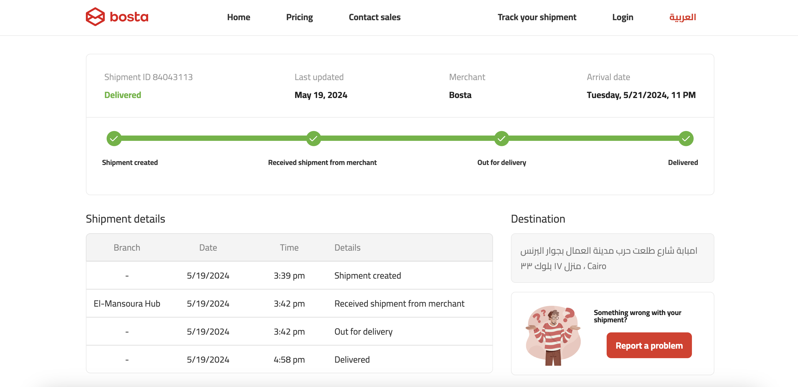

# Bosta Shipment Tracking Page

# Project Overview

- Project name: Bosta Shipment Tracking App
- Description: A React app that uses the Bosta Shipment tracking API to display shipment tracking information in a responsive UI, with support for both English and Arabic languages.
- Front-end framework: React
- State management: Redux
- Languages: TypeScript
- Font: Cairo

## API Integration

API endpoint: https://tracking.bosta.co/shipments/track/:trackingNumber
API parameters: trackingNumber (e.g. 84043113, 3468570, 40106705)

**API Response Handling**

The API response is handled in the getShipmmentData function, which is responsible for making a GET request to the Bosta Shipment tracking API.

src/services/getShipmmentData.ts
```
export const getShipmmentData = async (shipmentId: string) => {
  const res = await fetch(endpoints.getShipmentData + shipmentId);
  if (!res.ok) throw new Error("Something went wrong");
  const data = await res.json();
  return data;
};
```

**Response Handling Logic**

- The getShipmmentData function takes a shipmentId parameter, which is used to construct the API request URL.
- The function makes a GET request to the Bosta Shipment tracking API using the fetch function.
- The response is checked for errors using the res.ok property. If the response is not OK, an error is thrown.

**Error Handling**

In case of an error, the function throws an error with a message "Something went wrong". This error can be caught and handled by the ShipmentDetailsPage to display an error message.

## UI Components

- StatusTimeline: This component is responsible for rendering the shipment status progress bar and the comments around it. It can be found in src/components/StatusTimeline/StatusTimeline.tsx.
- DetailesSection: This component is responsible for rendering the shipment tracking information details history in a table. It can be found in src/components/DetailesSection/DetailesSection.tsx.
- Navbar: This component is responsible for rendering the navigation bar. It can be found in src/components/Navbar/Navbar.tsx.
- SearchForShipmentAtHome: This component is responsible for rendering the search bar for shipments. It can be found in src/components/SearchForShipmentAtHome/SearchForShipmentAtHome.tsx.
- SwitchLanguage: This component is responsible for rendering the language toggle button. It can be found in src/components/Navbar/components/SwitchLanguage.tsx.

## Responsive Design

The responsive design in the app is implemented using raw CSS in CSS module files for each component.

- Each component has its own CSS module file, which is responsible for styling that component.
- In the CSS module files, I use media queries to apply different styles based on the screen size (2 sizes).

## Language Support

The app supports two languages: English and Arabic. To implement language support, I used the i18next-react library.

**Saving Last Active Language**

To save the last active language, I used the localStorage API. When the user switches languages, we save the selected language to localStorage. When the user visits the app again, we retrieve the saved language from localStorage and set it as the active language.

## Screenshots




